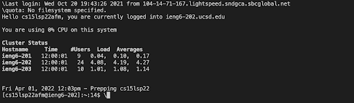

# Week 2 Lab Report
*By Luis Velediaz*

Welcome to CSE 15L. Glad to have you here! Today we will learn how to log into our course-specific account on ieng6 and a few efficient tools/strategies.

*READY? Lets go!*

## Follow these steps!

1) **Installing VS CODE**
- Go to the [Visual Studios Website](https://code.visualstudio.com/) and carefully download the application onto your local computer.
 
- Open the application, load it up and create a new file by clicking on file--> New File. It should look similar to this.


2) **Remotely Connecting**
- We must connect to our CSE-specific account that we will utilize for the time duration of the course, to start one must open the VS Code terminal (CTRL + ') and on it type the secure shell command and our account name. 

```
#Secure Shell Command
"ssh " + "cs15lsp22"+ YOUR specific course letters + "@ieng6.ucsd.edu"'
```

- Answer yes to the initiation messages you are given by the computer and type out your password when prompted by the server computer to do so.

- Once logged in, you can begin working on the server (CSE basement computer), meanwhile, your local computer becomes the client and the computer shall display you the last login date, failed log-ins, hostnames, percent usage of the CPU, and notices from the institution. (AS SHOWN BELOW)




3) **Run Some Commands**
- Now you have access to several commands that each invoke different unique actions in the terminal (CTRL + ' ONCE) of your local client computer or the server remote computer. (then type the COMMAND and enter) 

``` 
# Here is some COMMAND examples
cd ~ 
cd 
ls -lat 
ls -a 
ls < directory > 
cp 
cat 
```

- All of the commands are different tools that have unique actions, for example as shown on this terminal below, we ran the command ls -a which basically prints the list of files and directories available.


4) **Moving Files with SCP**
- Create a file in java, name it whereAmI.java, javac to compile and java whereAmI to run on the client computer.

``` 
#Now to remotely copy files from the client computer to the server computers through the usage of the client computer's
COMMAND scp + " " + whereAmI.java + " " + "cs15lsp22"+ YOUR specific course letters + "@ieng6.ucsd.edu"
<Password when prompted>
```


- Secure Shhell (SSH) log into the ieng6 account and use the command ls to see that the java file name file has been transferred to the ieng6's/server computer and we are able to compile and run it on the server with JAVAC and JAVA.


5) **Setting An SSH Key**
- The previous step probably took you a long time and would be repetitive if we had to do it on multiple occassions... but not to worry we have an easier solution which are SSH keys, a tool ( ssh-keygen ) that allows us to basically copy our public key to another server and with it use the file pairs to not require a password every time one tries to log in.

- To begin this process on your computer, type ($ ssh-keygen), whenever prompted to add a passphrase press enter (should happen twice), then in your computer's .ssh directory a private key and public key should be generated.

- We must copy this public key to the .ssh directory on the server by first splitting the terminal(client/server), then by typing on the local client terminal, 

```
"ssh " + "cs15lsp22"+ YOUR specific course letters + "@ieng6.ucsd.edu", when prompted to type your passwors type your passsword
```
once on the server you should type, 

```
mkdir .ssh
```
then on your client computer's terminal type 
```
"scp /Users/" + <user-name used in the comand> + "/.ssh/id_rsa.pub " + "cs15lsp22"+ YOUR specific course letters + "@ieng6.ucsd.edu"+ ":~/.ssh/authorized_keys"
```

and this should allow one to ssh your client computer to the server without using a password.


6) **Optimizing Remote Running**
- You're nearly done with this amazing tutorial, however just to make your life a bit easier while remote running well teach you a few more commands and techniques. 

- We can actually directly run commands on the remote server by simply, for example, in this situation below we ran ls which basically lists the currently available file lists and directory.

```
"ssh " + "cs15lsp22"+ YOUR specific course letters + "@ieng6.ucsd.edu" + COMMAND NEEDED
```


- We can also basically also run a lot of commands in the same terminal line by simply adding semi colons in between the commands. For example, typing on the server computer allows us to copy a file compile and run it all in one terminal line!
```
cp WhereAmI.java OtherMain.java; javac OtherMain.java; java WhereAmI
```
 

- Lastly just for efficiency tap your up arrow to retrieve the last command you have ran to more efficiently work; this will prevent a lot of repetitive and unnecessary typing.
 

7) **WOW YOUR'E DONE**
- GREAT JOB ON COMPLETING THE TUTORIAL! 
 
