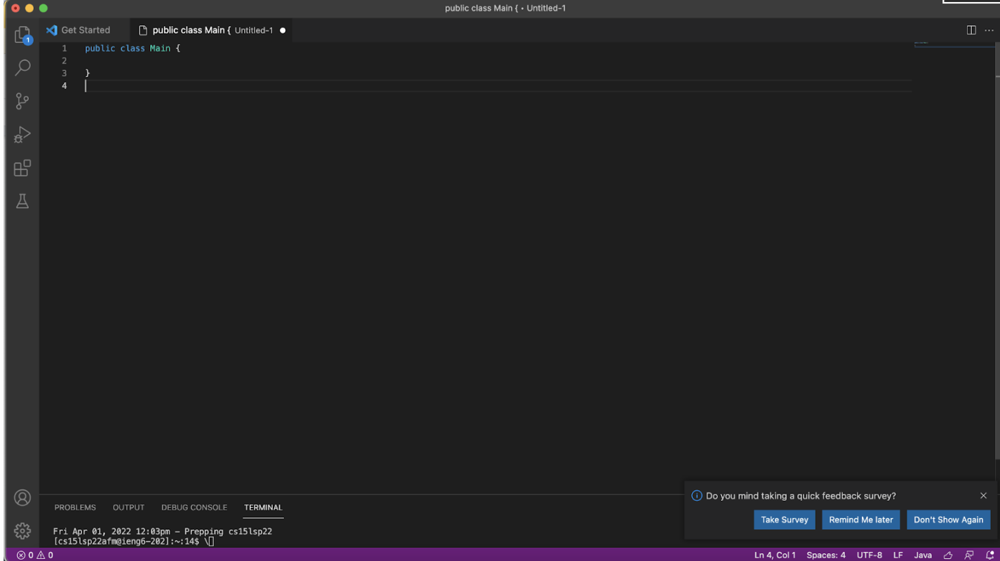

# Week 2 Lab Report
*By Luis Velediaz*

Welcome to CSE 15L. Glad to have you here! Today we will learn how to log into our course-specific account on ieng6 and a few efficient tools/strategies.

*READY? Lets go!*

## Follow these steps!

1) **Installing VS CODE**
- Go to the [Visual Studios Website](https://code.visualstudio.com/) and carefully download the application onto your local computer.
 
- Open the application, load it up and create a new file by clicking on file--> New File. It should look similar to this.




2) **Remotely Connecting**
- We must connect to our CSE-specific account that we will utilize for the time duration of the course, to start one must open the VS Code terminal (CTRL + ') and on it type the secure shell command and our account name. 

```
#Secure Shell Command
"ssh " + "cs15lsp22"+ YOUR specific course letters + "@ieng6.ucsd.edu"'
```

- Answer yes to the initiation messages you are given by the computer and type out your password when prompted by the server computer to do so.


7) **WOW YOUR'E DONE**
- GREAT JOB ON COMPLETING THE TUTORIAL! 
 


