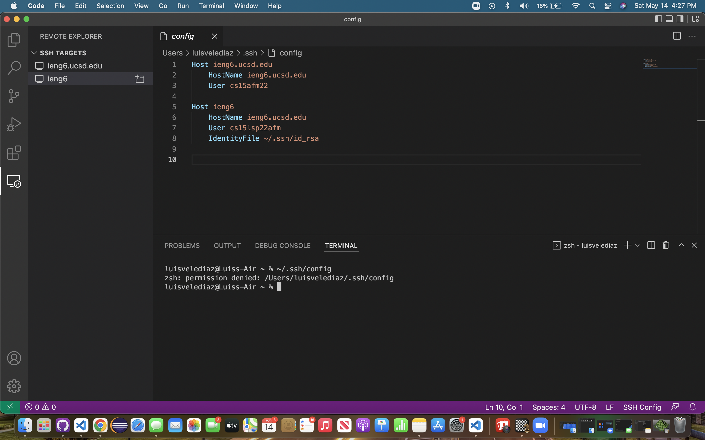
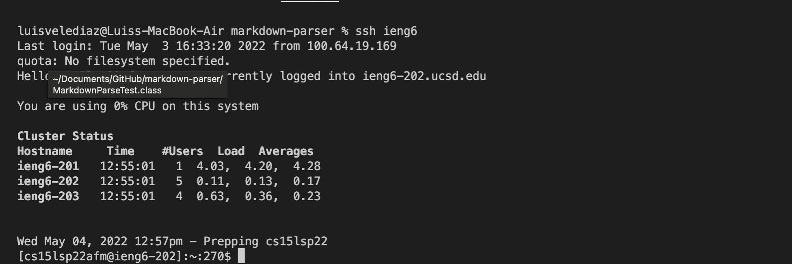
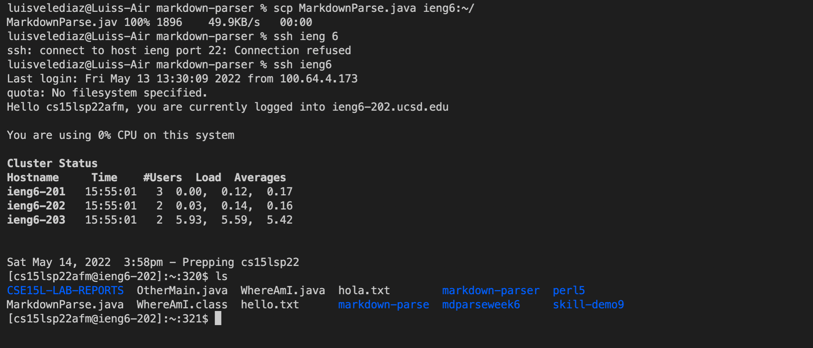
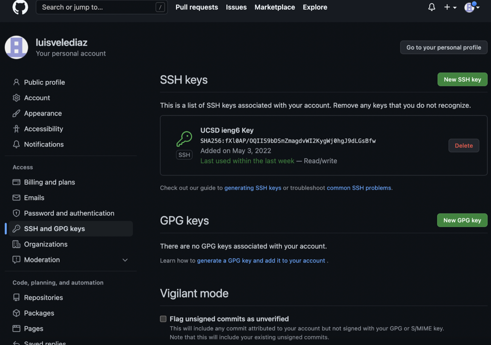
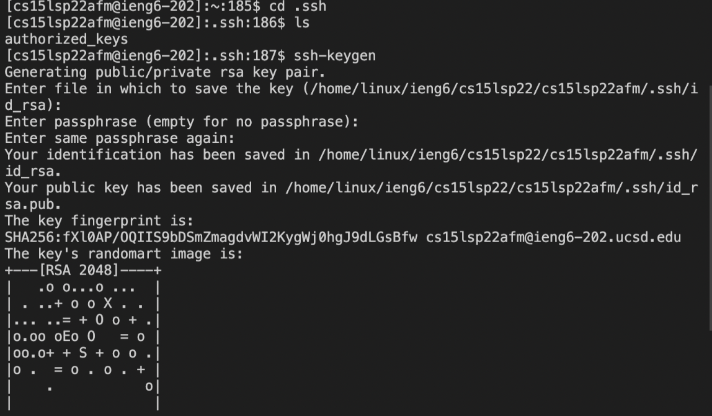
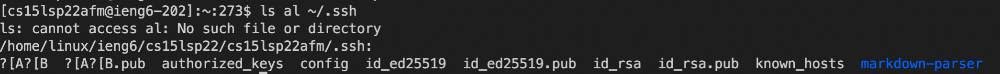
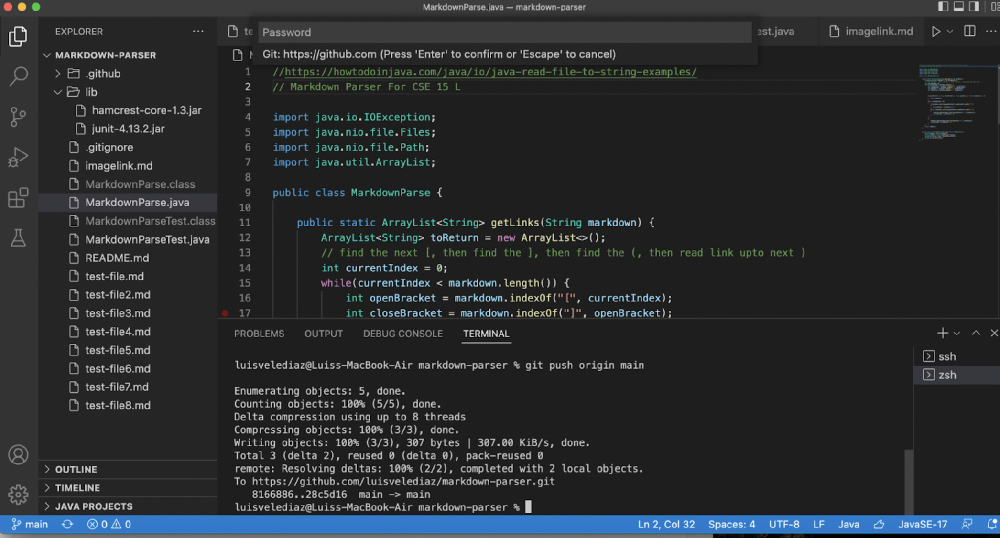
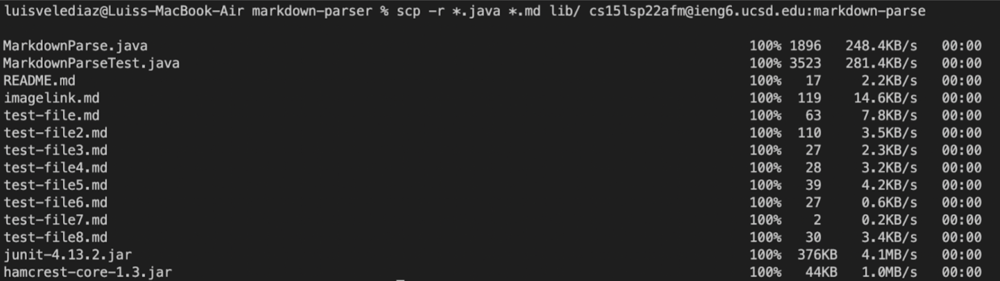
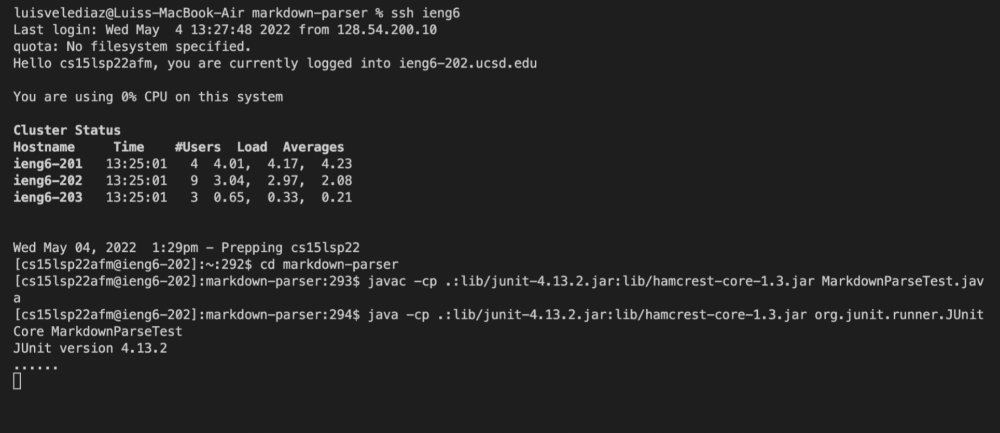

# Week 6 Lab Report
*By Luis Velediaz*

Welcome once again to CSE 15L. Glad to have you here! Today we will implement all Group Choice Options (1-3) from Lab 5. 

*READY? Lets go!*


1) *Streamlining ssh Configuration*


To log into our remote computer we have to type out some long string such as...
```
$ ssh cs15lsp22zzz@ieng6.ucsd.edu
```

This is inefficient, but not to worry we can save some time, effort and energy byt putting an entry inin ~/.ssh/config. This basically tells SSH a username to utilize to log into the serve computer with a given nickname such as ieng6 for our examples. If done as theyr'e supposed to be done, with 
```
$ ssh ieng6
```
we utilize the specefied key and log you in with the nickname.


- Here is my .ssh/config file, and how I edited it (with VScode, another program, etc)
 

- Here is the ssh command logging me into my account using just the alias I chose.


- Here is an scp command copying a file to my account using just the alias I chose.



2) **Setup Github Access from ieng6**


*Throughout our expierences with GITHUB, we have seen how to clone and pull. However, now we will show comitting and pushing from the command line. Represeneted by editting MarkdownParse.java we will try to add, commit, and push it via the terminal. We are required to use token-based like SSH keys. Basically we added the remote access public key we previously acquired to Github. We then apply commit and push to update our actual Github Repository.


- Here is where the public key I made is stored on Github and in my user account.


- Here is where the private key I made is stored on my user account (but not its contents).



- Here I run git commands to commit and push a change to Github while logged into my ieng6 account.


- Here is [a link for the resulting commit.](https://github.com/luisvelediaz/markdown-parser/commit/28c5d16f87d2d075c5805bbfb164829e4179b880)


3) **Copy whole directories with scp -r**
Copying lone files from entire directories with scp a lot of repeated times is inefficent, tedious and error prone. HOWEVER... thanks with SCP we can recursively copy all a directory's files and directories within it and everything within these objects too. As shown with the markdown-parse directory we can copy all of its contents to the cloud with one efficient line of terminal code. 

Basically by utilizing ...

```
$ scp -r . cs15lsp22@ieng6.ucsd.edu:~/markdown-parse
```
we can do copy the directory. "-r" basically tells the computer to utilize recursion. "." is the source. The last part is the creation of the directory on the remote serve along with the contentes within it being copied recursively. 


- Here I copy my whole markdown-parse directory to your ieng6 account.


- Here I log into my ieng6 account after doing this and compiling and running the tests for my repository.


- Here (like in the last step of the first lab) I combined scp, ;, and ssh to copy the whole directory and run the tests in one line.

```
scp -r . ieng6:~/markdown-parser; ssh ieng6 "cd markdown-parser; /software/CSE/oracle-java-17/jdk-17.0.1/bin/javac -cp .:lib/junit-4.13.2.jar:lib/hamcrest-core-1.3.jar MarkdownParseTest.java; /software/CSE/oracle-java-17/jdk-17.0.1/bin/java -cp .:lib/junit-4.13.2.jar:lib/hamcrest-core-1.3.jar org.junit.runner.JUnitCore MarkdownParseTest"
```


