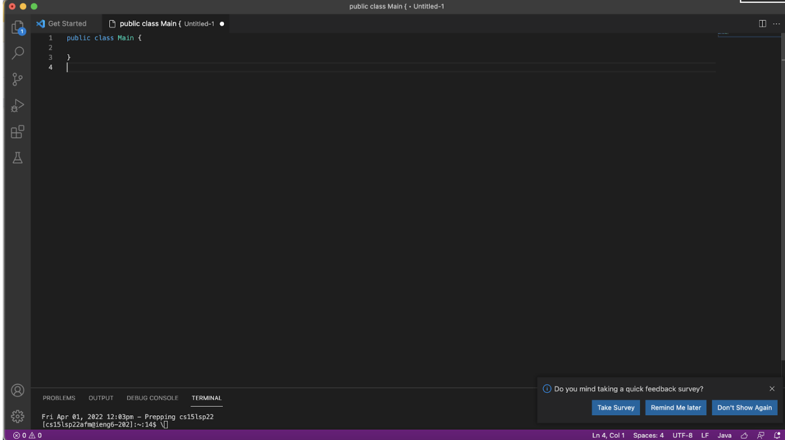
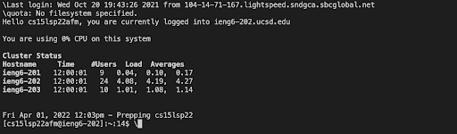
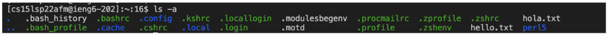

# Week 6 Lab Report
*By Luis Velediaz*

Welcome once again to CSE 15L. Glad to have you here! Today we will implement all Group Choice Options (1-3) from Lab 5. 

*READY? Lets go!*


1) *Streamlining ssh Configuration*
- Show your .ssh/config file, and how you edited it (with VScode, another program, etc)
- Show the ssh command logging you into your account using just the alias you chose.
- Show an scp command copying a file to your account using just the alias you chose.




2) **Setup Github Access from ieng6**
- We must connect to our CSE-specific account that we will utilize for the time duration of the course, to start one must open the VS Code terminal (CTRL + ') and on it type the secure shell command and our account name. 

```
#Secure Shell Command
"ssh " + "cs15lsp22"+ YOUR specific course letters + "@ieng6.ucsd.edu"'
```
- Show where the public key you made is stored on Github and in your user account (screenshot).
- Show where the private key you made is stored on your user account (but not its contents) as a screenshot.
- Show running git commands to commit and push a change to Github while logged into your ieng6 account.
- Show a link for the resulting commit.




3) **Copy whole directories with scp -r**
- Show copying your whole markdown-parse directory to your ieng6 account.
- Show logging into your ieng6 account after doing this and compiling and running the tests for your repository.
- Show (like in the last step of the first lab) combining scp, ;, and ssh to copy the whole directory and run the tests in one line.
``` 
# Here is some COMMAND examples
cd ~ 
cd 
ls -lat 
ls -a 
ls < directory > 
cp 
cat 
```

- All of the commands are different tools that have unique actions, for example as shown on this terminal below, we ran the command ls -a which basically prints the list of files and directories available.




