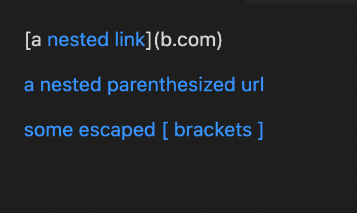

# Week 8 Lab Report
*By Luis Velediaz*

Welcome once again to CSE 15L. Glad to have you here! For each snippet, we will add a test both to our implementation of markdown-parse, and the implementation we reviewed in week 7. Run the tests and show the results of running the tests on each. This means we added a total of 6 test methods 


## **Here are the links to both markdown-parse repositories.**

My group’s [markdown-parse repository.](https://github.com/bchoUCSD/markdown-parser)

Link to the [markdown-parse repository we reviewed in week 7.](https://github.com/KristinEbu/markdown-parser)

*READY? Let's go!*

## ***SNIPPET 1***

```
**Snippet 1 CODE**
`[a link`](url.com)

[another link](`google.com)`

[`cod[e`](google.com)

[`code]`](ucsd.edu)
```
**What is read?**


**What is the expected output?** 
-  

**The code in MarkdownParseTest.java for how I turned it into a test.**
- 

1) *Snippet 1 Our Repository*
- For our implementation, the corresponding output when running the tests didn’t pass, and here is the specific part of the JUnit output that shows the test failure.
-  


2) *Snippet 1 Reviewed Repository*
- For the implementation I reviewed in Week 7, the corresponding repository didn’t pass, and here is the specific part of the JUnit output that shows the test failure.
- 


## ***SNIPPET 2***
```
**Snippet 2 CODE**
[a [nested link](a.com)](b.com)

[a nested parenthesized url](a.com(()))

[some escaped \[ brackets \]](example.com)
```
**What is read?**


**What is the expected output?** 
- 

**The code in MarkdownParseTest.java for how I turned it into a test.**
- 

3) *Snippet 2 Our Repository*
- For our implementation, the corresponding output when running the tests, passed.

4) *Snippet 2 Reviewed Repository*
- For the implementation, we reviewed in Week 7, the corresponding output when running the tests passed.

## ***SNIPPET 3***

```
**Snippet 3 CODE**
[this title text is really long and takes up more than 
one line

and has some line breaks](
    https://www.twitter.com
)

[this title text is really long and takes up more than 
one line](
https://sites.google.com/eng.ucsd.edu/cse-15l-spring-2022/schedule
)


[this link doesn't have a closing parenthesis](github.com

And there's still some more text after that.

[this link doesn't have a closing parenthesis for a while](https://cse.ucsd.edu/


)

And then there's more text
```
**What is read?**


**What is the expected output?** 
- 

**The code in MarkdownParseTest.java for how I turned it into a test.**
- 

5) *Snippet 3 Our Repository*
- For our implementation, the corresponding output when running the tests didn’t pass, and here is the specific part of the JUnit output that shows the test failure.

-  


6) *Snippet 3 Reviewed Repository*
- For the implementation I reviewed in Week 7, the corresponding repository didn’t pass, and here is the specific part of the JUnit output that shows the test failure.
- 


# ***REVIEW QUESTIONS***
1) Do you think there is a small (<10 lines) code change that will make your program work for snippet 1 and all related cases that use inline code with backticks? If yes, describe the code change. If not, describe why it would be a more involved change.

- In my opinion, I believe that a small code change would make the program work for snippet 1 uses incline code with backticks. I think that as long as the backtick goes after the bracket or parenthesis, the image format will override it. So for this code, we will basically add an if statement that checks for the backtick if it goes before the "[ " and then doesn't add this link to the list. If there is no backtick then the program will continue to run normally. 


2) Do you think there is a small (<10 lines) code change that will make your program work for snippet 2 and all related cases that nest parentheses, brackets, and escaped brackets? If yes, describe the code change. If not, describe why it would be a more involved change.

- In my opinion, I believe that a more involved code change would make the program work for snippet 2 uses incline code with nested parenthesis and brackets. This is because I think that as of right now we have the code mostly functioning as, during our tests, it passed. However, I believe that we can improve it by tacking the number of parentheses and brackets. We would have to be confident that the program solely adds starting and ending parenthesis and brackets. I also believe this would require a large number of trackable variables and multiple if statements to meet the necessary conditions
 

3) Do you think there is a small (<10 lines) code change that will make your program work for snippet 3 and all related cases that have newlines in brackets and parentheses? If yes, describe the code change. If not, describe why it would be a more involved change.

- I think a small code change will be needed to make the program work for snippet 3 and all the related cases with newlines in brackets and parenthesis. I believe that the code must simply check for an empty line, which breaks the MD format of a link. We should be able to use an if statement that makes sure that there is no full line break since we already solved the issue of checking for specifically the format "MD link-format". If that format is broken or there is an entire line of blank code (line break) then the link won't be added.
