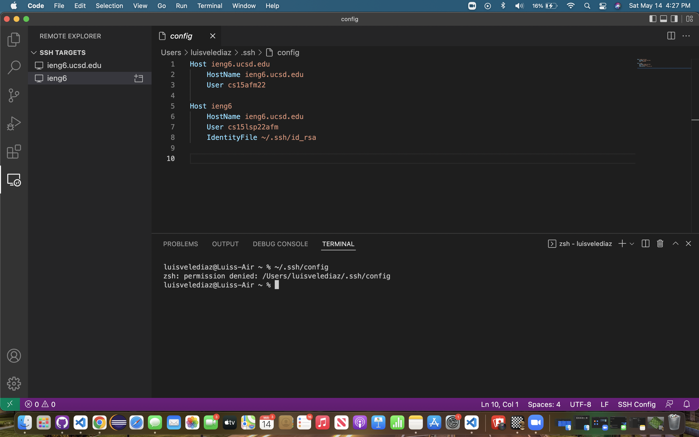

# Week 6 Lab Report
*By Luis Velediaz*

Welcome once again to CSE 15L. Glad to have you here! For each snippet, we will add a test both to our implementation of markdown-parse, and the implementation we reviewed in week 7. Run the tests and show the results of running the tests on each. This means we added a total of 6test methods 


```
**Snippet 1**
`[a link`](url.com)

[another link](`google.com)`

[`cod[e`](google.com)

[`code]`](ucsd.edu)
```
```
**Snippet 2**
[a [nested link](a.com)](b.com)

[a nested parenthesized url](a.com(()))

[some escaped \[ brackets \]](example.com)
```
```
**Snippet 3**
[this title text is really long and takes up more than 
one line

and has some line breaks](
    https://www.twitter.com
)

[this title text is really long and takes up more than 
one line](
https://sites.google.com/eng.ucsd.edu/cse-15l-spring-2022/schedule
)


[this link doesn't have a closing parenthesis](github.com

And there's still some more text after that.

[this link doesn't have a closing parenthesis for a while](https://cse.ucsd.edu/


)

And then there's more text
```


*READY? Lets go!*


1) *Streamlining ssh Configuration*


To log into our remote computer we have to type out some long string such as...
```
$ ssh cs15lsp22zzz@ieng6.ucsd.edu
```

This is inefficient, but not to worry we can save some time, effort and energy byt putting an entry inin ~/.ssh/config. This basically tells SSH a username to utilize to log into the serve computer with a given nickname such as ieng6 for our examples. If done as theyr'e supposed to be done, with 
```
$ ssh ieng6
```
we utilize the specefied key and log you in with the nickname.


- Here is my .ssh/config file, and how I edited it (with VScode, another program, etc)
 
 
 
For each snippet, add a test both to your implementation of markdown-parse, and the implementation you reviewed in week 7. Run the tests and show the results of running the tests on each. This means you should add a total of 6 test methods (3 to your implementation and 3 to the one you reviewed).

This means you will need to clone and run both your implementation and the one you reviewed in week 7, make some small edits, and run them both.

Your report should include:

A link to your markdown-parse repository and a link to the one you reviewed in week 7

For each test above:

Decide on what it should produce (i.e., expected output) by using either VScode preview or the CommonMark demo site

Showing the code in MarkdownParseTest.java for how you turned it into a test

For your implementation, the corresponding output when running the tests; if it passed, say so. If it didn’t pass, show the specific part of the JUnit output that shows the test failure.

For the implementation you reviewed in Week 7, the corresponding output when running the tests; if it passed, say so. If it didn’t pass, show the specific part of the JUnit output that shows the test failure.

Answer the following questions with 2-3 sentences each:

Do you think there is a small (<10 lines) code change that will make your program work for snippet 1 and all related cases that use inline code with backticks? If yes, describe the code change. If not, describe why it would be a more involved change.
Do you think there is a small (<10 lines) code change that will make your program work for snippet 2 and all related cases that nest parentheses, brackets, and escaped brackets? If yes, describe the code change. If not, describe why it would be a more involved change.
Do you think there is a small (<10 lines) code change that will make your program work for snippet 3 and all related cases that have newlines in brackets and parentheses? If yes, describe the code change. If not, describe why it would be a more involved change.
