# Week 10 Lab Report
*By Luis Velediaz*

In lab 9, we experimented with the many tests provided under the test-files/ folder. For this lab report,we chose tests with different answers that should correspond to different bugs to further try to understand the given code.

### *READY? Let's go!*

# **How did I find the tests with different results?**
This was actually quite simple. I didn't use vimdiff. At first I just printed the test files from the main method. Then I simply manually ran differeing files hoping to find ones that produced differening outputs. This was done through the utilization of random test cases I developed. 

Here is a screenshot from the print line.

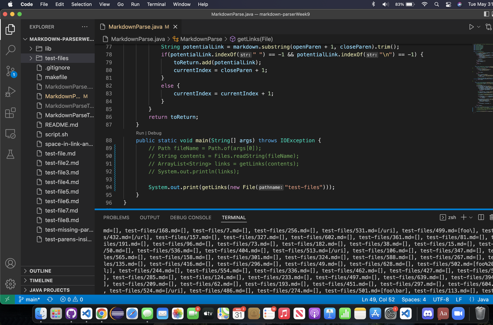


## ***TEST 1***

This is the [Link for test file 418.](https://github.com/nidhidhamnani/markdown-parser/blob/main/test-files/418.md).

**My Repository Output:** 

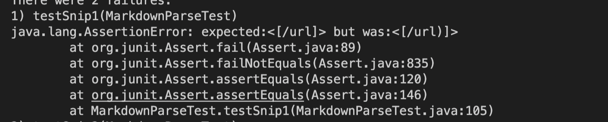

**Week 9 Repository Output:** 

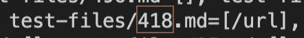

**Common Mark:**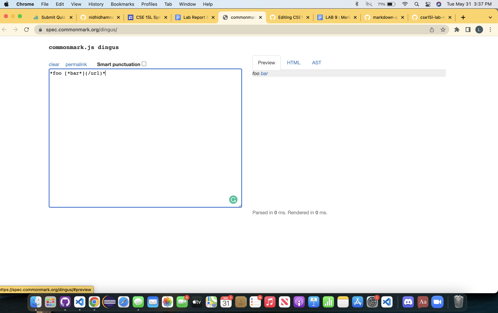

**What is read?**: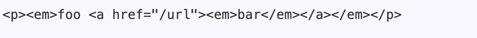

Expected Output:
```
/url
```

### ***What is the problem?***
My repo:
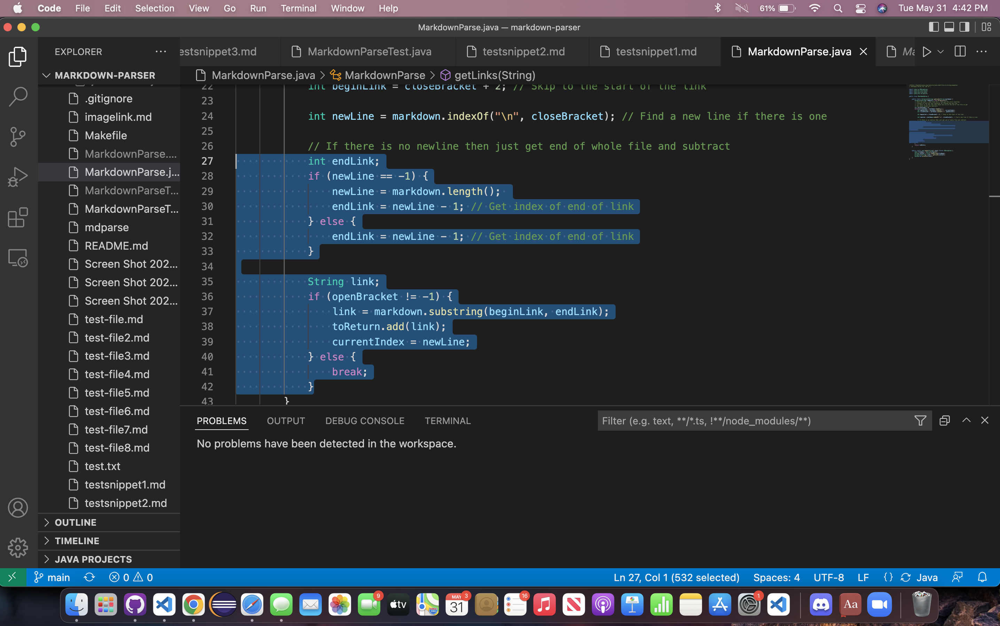


I believe that my implementation of the Markdown Parse is wrong. I believe that the issue here is that we havent been able to fully develop a code that properly utilizes the end bracket or parenthesis. Instead the file just goes to the end of the end of line and just adds everything from the intial parenthesis. I believe that is why the parenthesis was added to the list alongside the link.


## ***TEST 2***

This is the [Link for test file 519.](https://github.com/nidhidhamnani/markdown-parser/blob/main/test-files/519.md).

**My Repository Output:** 

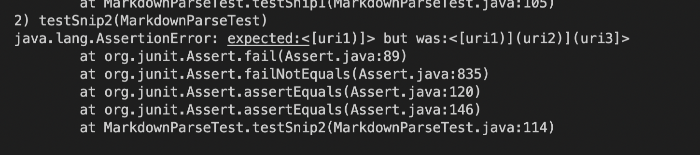

**Week 9 Repository Output:**

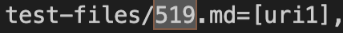

**Common Mark:**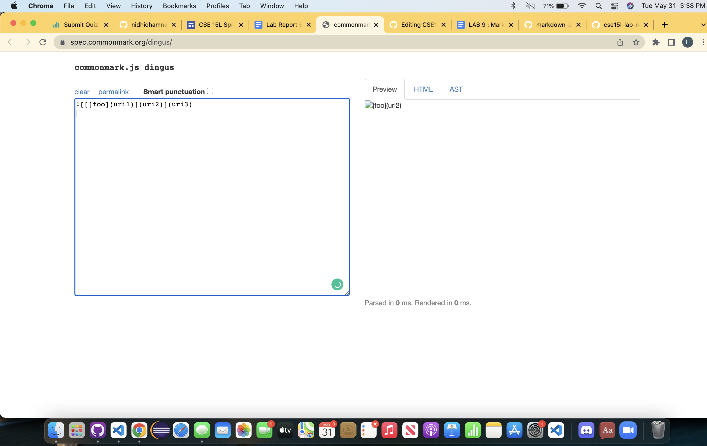

**What is read?**: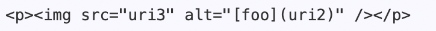

Expected Output:
```
[]
```

### ***What is the problem?***
My Repo: 

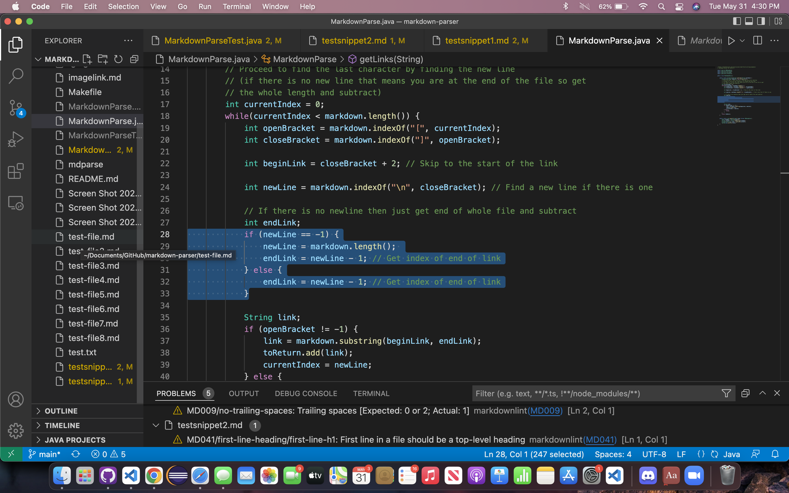

Week9 Repo
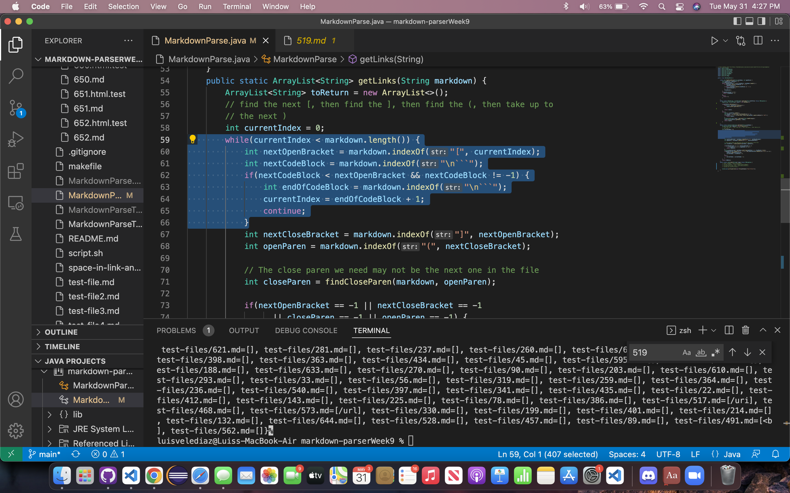

I believe that both implementations of the Markdown Parse are wrong.For my grupos repository I believe that our Markdown Parse is just looking for the end of the line and checking to see if it is a parenthesis and just adding everything inside of it to the list, without considering the other markdown format. For the repository we reviewed I believe that their implementation simply doesn't check for the exclamation point that of images, and disregards this key feature thus adding it to the list as if it were a link.
