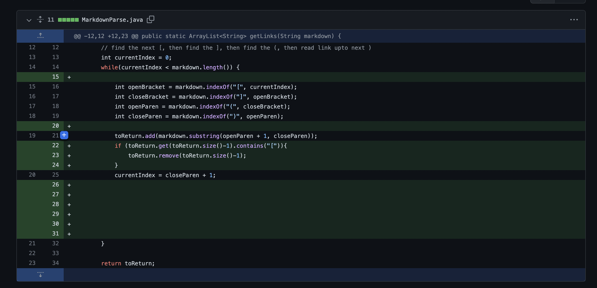

# Week 4 Lab Report2
*By Luis Velediaz*

Welcome to CSE 15L. Glad to have you here! Today we will fix some bugs in a code "MarkdownParse" that ***ONLY*** extracts the url from a .md file in markdown format.

*What is the correct way to format a website in Markdown Format?*

```
# Markdown Wesbite Format
[Link](http://a.com)
```

*If we run MarkdownParse on this md file, what should the output be?*

```
[http://a.com]
```

MarkdownParse works fine in this instance, however there is some bugs in it that need to be fixed as we will see with the following test cases.


1) **Code Test Case 1**

- Here is ink to the test file for the [first failure-inducing input](https://github.com/cjramosUCSD/markdown-parser/commit/0c67b096848a0801a0789ad13f0a3f0cddb703bf)
that prompted us to make that change.

- *Sympton of the failure inducing input!*


- Within this program the sympton of the bug in this code is one of logic. This is because the index goes out bounds when searching for the url's closing bracket since it doesn't exist where the website url should be.

- The sympton in this code is the crash that happens as the programs runs out of memory since there isn't a closing bracket that is required to end a loop in the original code.

- The failure-inducing input is just a word with just and opening bracket. If correctly functioning the code should not crash because the md file isn't technically in website markdwon form. This crash would happen whenever we introduce a bracket and don't close it, thus it could occur with just [link name or any  strings with unclosed brackets.

- **Here is what my team did to fix this bug in the form of a screenshot of the code change diff from Github!**



2) **Code Test Case 2**

- Link to the test file for the [second failure-inducing input](https://github.com/cjramosUCSD/markdown-parser/commit/ef013dd6740a14a7d2c7c3621ec817d8e5cb753c)
that prompted us to make that change.

- *Sympton of the failure inducing input!*


- For this coding program anothere bug is a sematic error where the code doesn't recognize the need for brackets[] in order for the image to be in md format. So whenever there is parentheis, the code thinks it is a url.

- Thus the program will try to extract the url from any place where parenthesis exist in the md file, causing the sympton to be the returning of incorrect items. The code will try to return what is inside any sets of parenthesis when in fact it shouldn't return anything since the parenthesis by themeselves are not a link.

- As seen from the failure-inducing input we have any string inside of the parenthesis such as (something.com) and instead of returning a blank line it retruns [something.com] as the code can't differentiate this is not a url.

 - **Here is what my team did to fix this bug in the form of a screenshot of the code change diff from Github!**
 


3)**Code Test Case 3**

- Link to the test file for the [third failure-inducing input](https://github.com/bchoUCSD/markdown-parser/commit/aab02998c981b1a7324203f52720e5afd90903f5)

- *Sympton of the failure inducing input!*
 


- The bug in this situation is a logic error, as basically the program believes that anything with in the form [link](www.link.com) is basically a wesbite. Yet the code doesn't account that the image MD format is quite similiar as we just add an exclamation mark  before the brackets.

- The sympton in the program is the return of the wrong items. As markdown experts, we know that if there is an exclamation point before the brackets, it is an image. Thus the program should recognize this and not take into consideration when looking to extract the websites.

- The failure-inducing input basically causes this as we have an exclamation point before the brackets and the code should return a blank line, however it returns what is inside of the parenthesis or the image path. This is because our code can't tell that this is in fact an image and not a website.

- **Here is what my team did to fix this bug in the form of a screenshot of the code change diff from Github!**

